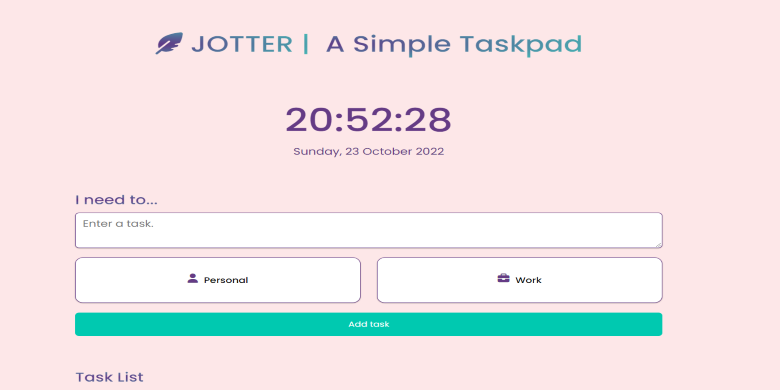

# Jotter | A Simple Taskpad

Jotter is a simple Task / To-do Web App that stores data on Local Storage of your browser. 


<br>
Built using HTML, CSS and JS.
<br>
Demo hosted on Vercel - https://jotter-i4xq.vercel.app/

<br>


## Dependencies
```
lite-server
```

<br>

## Getting Started
```
npm install lite-server --save-dev
npm start
```

<br>

## Inside package.json...
```
 "scripts": {
    "lite": "lite-server --port 5501", 
    "start": "npm run lite"}
```




